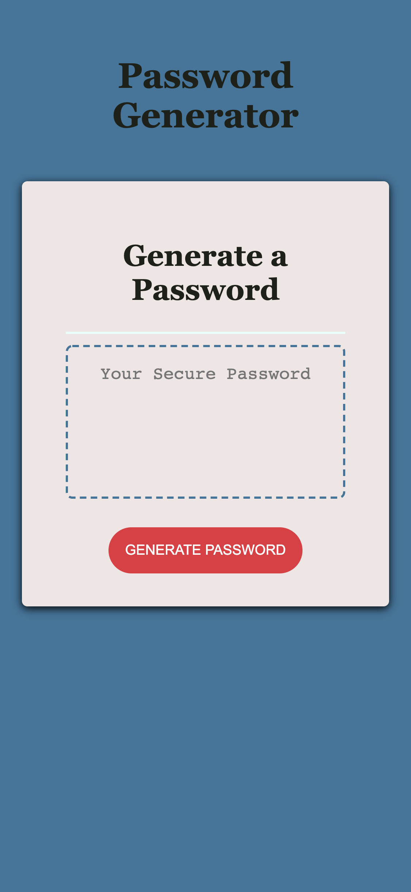

# 03 JavaScript: Password Generator
## Description

For this project I modified starter code to create an application that enables users to generate random passwords based on criteria they have selected.

When a user clicks the button to generate a password they a presented with a series of prompts for password criteria. 

The first prompt is the length of the password which the user has to chose between 8 - 128. If the answer is outside the number parameters the user is looped back to answer again.

The user is then prompted if they would like to include lowercase, uppercase, numeric and/or special characters. If no parameters are chosen the user is looped back to answer again. 

When all prompts are answered a password is generated and displayed on the window. 

## Problems 
I had an immense amount of problems with this application. I was unable to create a code of my own and wanted to submit something so I worked off of [Password-Generator](https://github.com/TiffanyCasey/Password-Generator). From going over this code I learnt an immense amount but was frustrated I could not create a code of my own. I have written comments along the code so that I know how it works.

## Usage
 

[Link to deployed application](https://github.com/harmane4/password-generator)

## Credits
Websites used to create application: 
 
[Build A Password Generator With JavaScript](https://www.youtube.com/watch?v=iKo9pDKKHnc&t=191s)

[JavaScript Password Generator](https://www.youtube.com/watch?v=duNmhKgtcsI)

[Password-Generator](https://github.com/TiffanyCasey/Password-Generator)

[Math.random()] (https://developer.mozilla.org/en-US/docs/Web/JavaScript/Reference/Global_Objects/Math/random)

## License 
[MIT](https://choosealicense.com/licenses/mit/)

